# adder-fp-sd
Projeto de Somador de Ponto Flutuante em FPGA proposto na disciplina de Sistemas Digitais da UFABC

# Tutorial: Implementação de Somador Ponto Flutuante na DE10-Lite

**Autores:** Guilherme Carvalho Torres, João Paulo Vieira de Carvalho, João Pedro Kayano Leal

**Disciplina:** Sistemas Digitais Q2.2026

**Data:** 07-08-2026

---

# *Etapa 1*

## 1. Objetivo do Projeto

Este projeto tem como objetivo validar, adaptar e implementar na placa DE10-Lite um somador de ponto flutuante simplificado de 13 bits, originalmente apresentado para outra arquitetura de FPGA.

Cada número possui a seguinte organização:

```text
sinal | expoente | fração
1 bit | 4 bits   | 8 bits
```

O valor é interpretado como:

```text
(-1)^sinal × 0.fração × 2^expoente
```

## 2. Descrição gráfica do funcionamento do sistema

O somador recebe dois operandos, cada um dividido em sinal, expoente e fração:

```text
Operando 1: sign1 | exp1 | frac1
Operando 2: sign2 | exp2 | frac2
```

O processamento é dividido em quatro estágios:

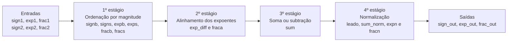

Uma descrição de cada etapa pode ser visualizada no arquivo fp_adder_tratado.vhd dentro da pasta `etapa_01`. Em essência, o código separa os dois operando em partes maiores e menores (b - bigger e s - smaller) em relação ao sinal (sign), expoente (exp) e fração (frac). Primeiro ele identifica qual o de maior magnitude (em módulo), o que corresponde ao primeiro estágio. Depois, ele desloca a fração menor de acordo com a diferença dos expoentes (2º estágio). A soma é feita se os signais são iguais ou a diferença, caso os sinais sejam diferente (3º estágio). Por último, é feita a normalização (deslocamento de 0 e ajuste do expoente, quando necessário). Isto corresponde ao quarto estágio. Após todas estas etapas, temos as 3 saídas.

### Casos usados para validar o funcionamento

Na Etapa 1 foram verificados cinco comportamentos:

| Caso | Comportamento analisado |
|---|---|
| 1 | alinhamento de expoentes |
| 2 | normalização com deslocamento à esquerda |
| 3 | resultado pequeno demais para representação |
| 4 | soma com carry out |
| 5 | segundo operando com maior magnitude |

A comparação entre as saídas do testbench e os sinais internos `sum`, `leado`, `sum_norm`, `expn` e `fracn` confirmou o funcionamento esperado nos casos analisados.

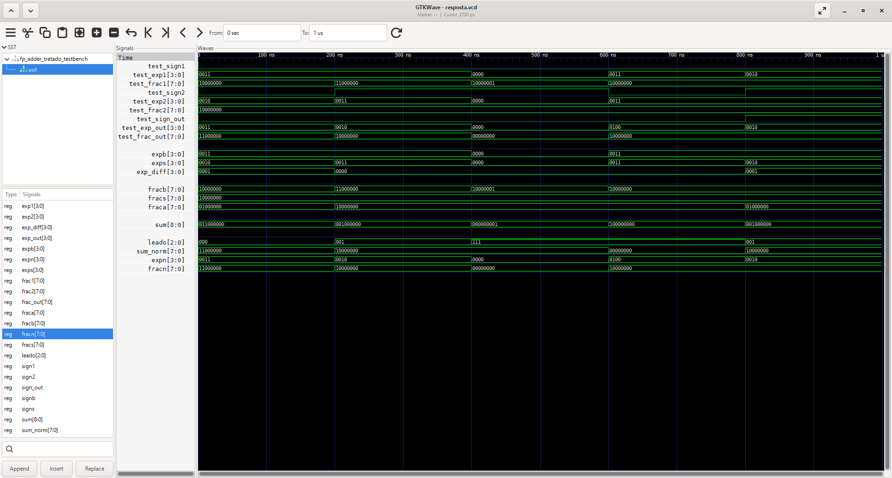

# *Etapa 2*

## 3. Adaptações de Hardware (DE10-Lite)

A arquitetura original utilizava um barramento compartilhado para os quatro displays de sete segmentos. O componente `disp_mux`, controlado por `clk`, alternava rapidamente o display ativo, enquanto `an` selecionava o display e `sseg` transportava o padrão dos segmentos.

Na DE10-Lite, cada display possui uma saída independente. Por isso, a multiplexação original deixou de ser necessária.

**O que mudamos no VHDL original:**

* Removemos as entradas e saídas `clk`, `an` e `sseg`.
* Removemos o componente `disp_mux`.
* Substituímos as saídas antigas pelos barramentos independentes `HEX3`, `HEX2`, `HEX1` e `HEX0`.
* Adaptamos as entradas para os dez switches `SW(9 downto 0)` e os dois botões `KEY(1 downto 0)` da DE10-Lite.
* Criamos o componente `hex_to_7seg_de10_lite` para converter valores de 4 bits nos padrões ativos em nível baixo dos displays.
* Ligamos diretamente o sinal do resultado ao display `HEX3`, usando um traço para números negativos e apagando-o para números positivos.
* Criamos um novo testbench para confirmar que a adaptação não alterou a lógica matemática.

Todos os arquivos podem ser encontrado na pasta `etapa_02/02-codigo-final`. Os arquivo lá encontradas contém o seguinte:

- fp_adder.vhd: arquivo inicial proposto no projeto, com a lógica de soma de dois números binários de ponto flutuante
- fp_add_test_de10_lite.vhd: adaptação do código inicial proposto no projeto, considerando a placa DE10-Lite disponibilizada em laboratório
- hex_to_7seg_de10_lite.vhd: Código para conversão de entradas de 4 bits para display de 7 segmentos.
- fp_adder_test_de10_lite_testbench.vhd: Testes criados para analisar se o código iniciar (fp_adder.vhd) mantinha o comportamento esperado, após a adaptação para a placa DE10-Lite.

### Distribuição das entradas

O primeiro operando possui sinal e expoente fixos. Dois bits de sua fração são controlados por switches:

```vhdl
sign1 <= '0';
exp1  <= "1000";
frac1 <= '1' & SW(1) & SW(0) & "10101";
```

O segundo operando é formado por switches e botões:

```vhdl
sign2 <= SW(9);
exp2  <= SW(8 downto 5);
frac2 <= '1' & (not KEY(1)) & (not KEY(0)) & SW(4 downto 0);
```

Os botões `KEY` são ativos em nível baixo:

```text
botão solto       → KEY = 1 → bit 0 após o not
botão pressionado → KEY = 0 → bit 1 após o not
```

Os sinais `SW(1)` e `SW(0)` são compartilhados: participam da formação das frações dos dois operandos.

### Distribuição das saídas

```text
HEX3 | HEX2             | HEX1             | HEX0
sinal | fração bits 7..4 | fração bits 3..0 | expoente
```

| Display | Informação apresentada |
|---|---|
| `HEX3` | sinal do resultado |
| `HEX2` | quatro bits mais significativos da fração |
| `HEX1` | quatro bits menos significativos da fração |
| `HEX0` | expoente do resultado |

Os displays são ativos em nível baixo:

```text
0 → segmento aceso
1 → segmento apagado
```

O sinal é apresentado por:

```vhdl
HEX3 <= "1111110" when sign_out = '1' else "1111111";
```

### Descrição gráfica do sistema adaptado

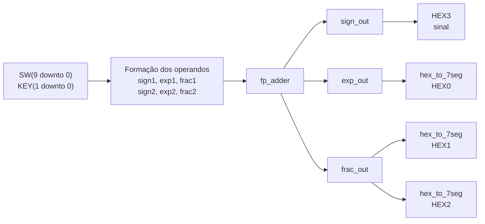

Os quatro casos usados no novo testbench foram:

| Caso | `SW` | `KEY` | Displays esperados |
|---|---|---|---|
| alinhamento dos expoentes | `0011100000` | `11` | `d58` |
| soma com carry out | `0100000000` | `11` | `8A9` |
| segundo operando negativo e maior | `1100000000` | `00` | `-967` |
| sete deslocamentos na normalização | `1100010100` | `11` | `801` |

OBS: No terceiro caso, os dois botões precisam permanecer pressionados durante a observação.

## 4. Evidências de Validação

### Simulação 

A adaptação foi compilada com GHDL e analisada no GTKWave. Primeiro foram observadas as saídas destinadas aos displays:

```text
test_SW
test_KEY
test_HEX3
test_HEX2
test_HEX1
test_HEX0
```

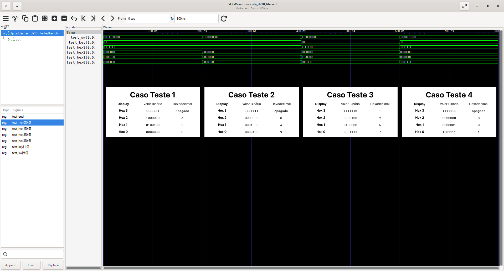

As contas manuais dos quatro casos estão registradas abaixo:

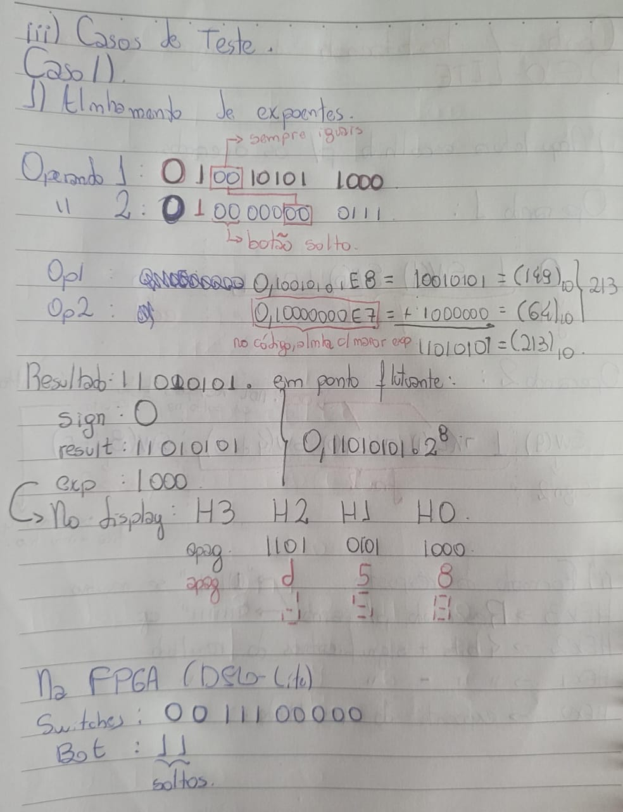

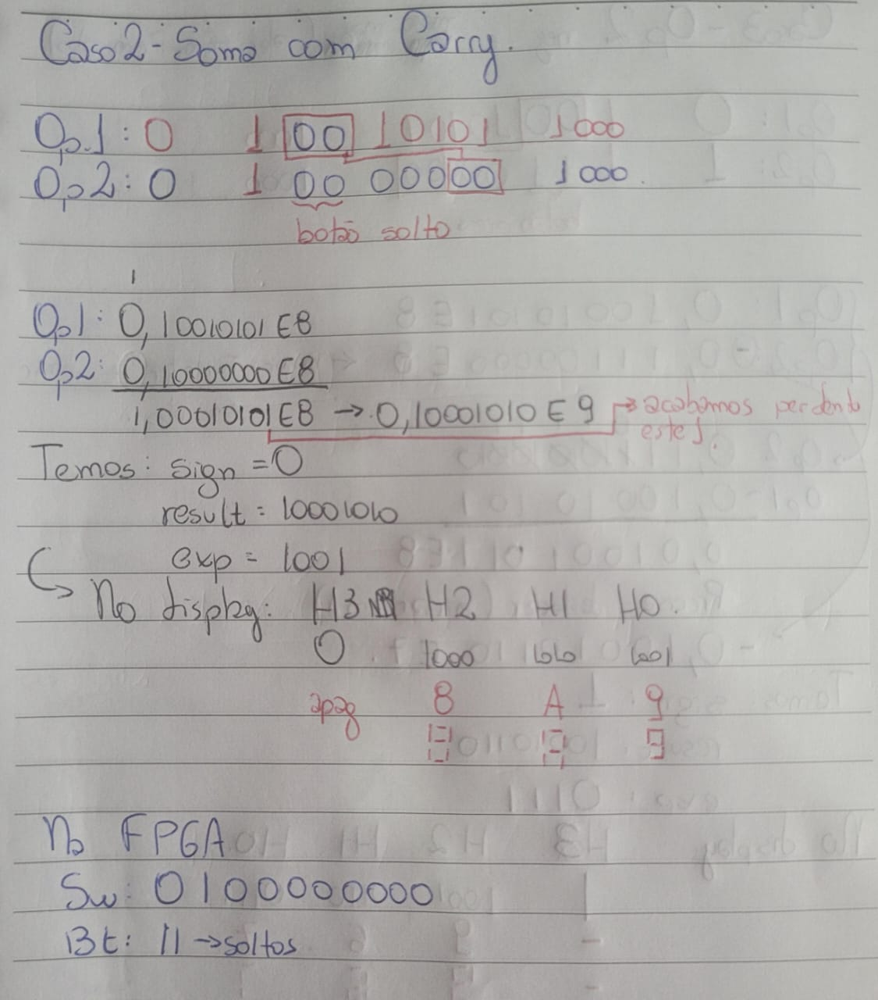

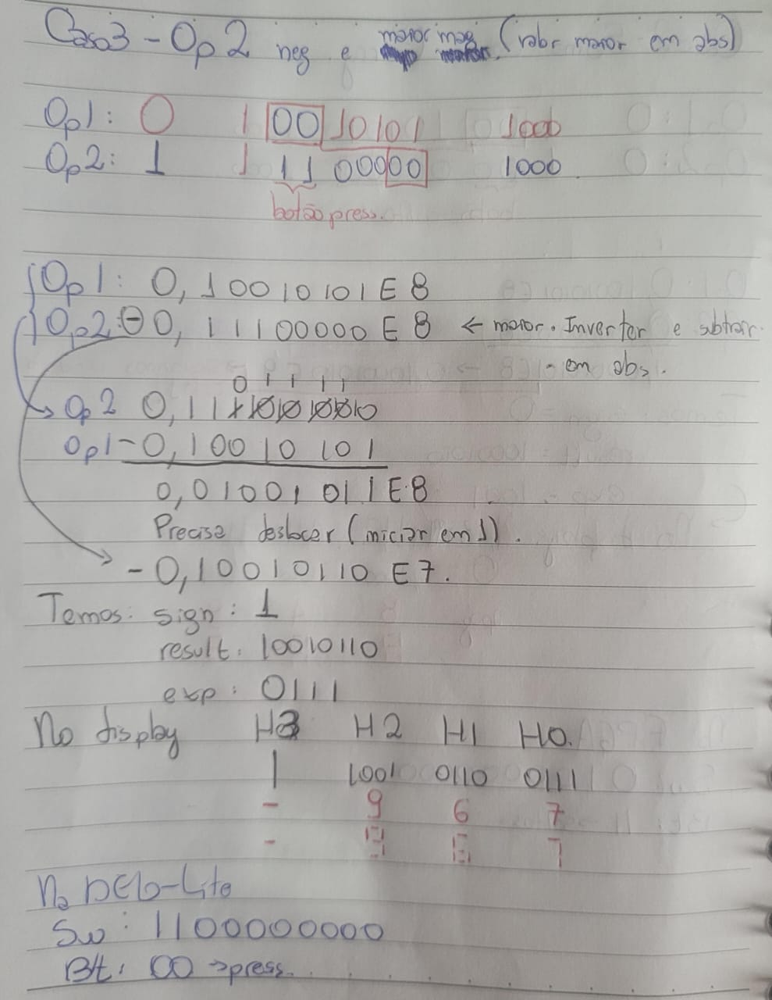

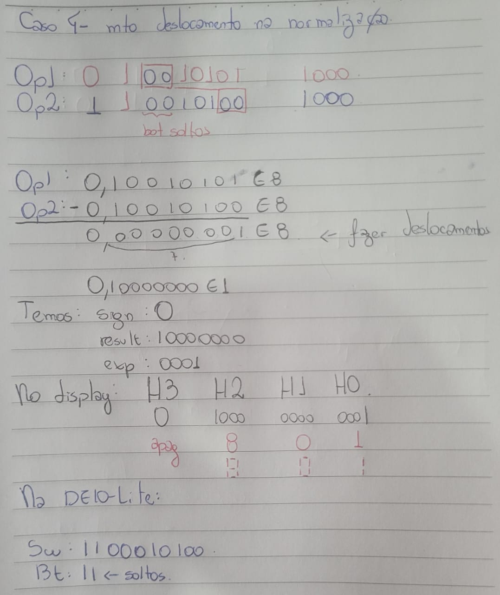

Também foram observados os sinais internos do `fp_adder`:

```text
sum
leado
sum_norm
expn
fracn
```

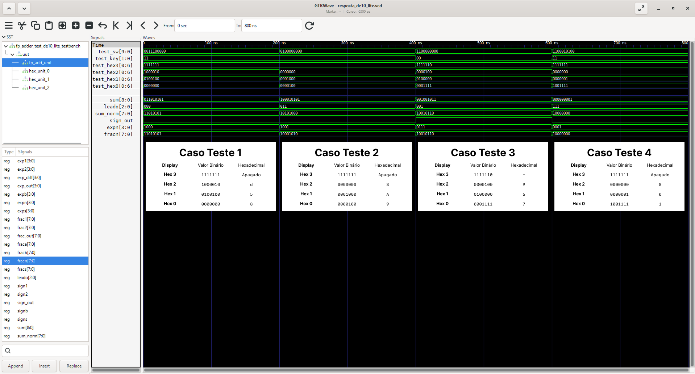

No caso de carry out (caso 2), o bit adicional de `sum` assumiu valor `1`, provocando o deslocamento da fração para a direita e o aumento do expoente.

No caso de grande deslocamento:

```text
leado = 111₂ = 7
```

Isso confirma a realização de sete deslocamentos à esquerda durante a normalização.

Para os quatro casos analisados, as saídas destinadas aos displays e os sinais internos coincidiram com os resultados calculados manualmente.

### Código VHDL Final 

O circuito final para síntese é formado por três arquivos:

```text
fp_adder.vhd
hex_to_7seg_de10_lite.vhd
fp_adder_test_de10_lite.vhd
```

O arquivo de testbench não é incluído na síntese da FPGA.

Para não deixar este README muito longo, está sendo indicado o caminho para cada um dos arquivos de código final em VHDL

#### `fp_adder.vhd`

Disponível em `etapa_03/arquivos-necessarios/fp_adder.vhd`

#### `hex_to_7seg_de10_lite.vhd`

Disponível em `etapa_03/arquivos-necessarios/hex_to_7seg_de10_lite.vhd`

#### `fp_adder_test_de10_lite.vhd`

Disponível em `etapa_03/arquivos-necessarios/fp_adder_test_de10_lite.vhd`

# *Etapa 3*

### Funcionamento na Placa

> Esta seção será finalizada após a síntese e os testes no laboratório.

O projeto será configurado no Intel Quartus Prime Lite com:

```text
Projeto: adder_fp_de10_lite
Família: MAX 10
Dispositivo: 10M50DAF484C7G
Top-Level Entity: fp_adder_test_de10_lite
```

Os casos planejados para o teste físico são os mesmos descritos anteriormente:

| Caso | `SW` | `KEY` | Esperado | Obtido |
|---|---|---|---|---|
| alinhamento | `0011100000` | `11` | `d58` | `d58` |
| carry out | `0100000000` | `11` | `8A9` | `8A9` |
| negativo | `1100000000` | `00` | `-967` | `-967` |
| deslocamento | `1100010100` | `11` | `801` | `801` |

Abaixo, serão adicionadas as imagens do funcionamento na placa para os quatro casos:

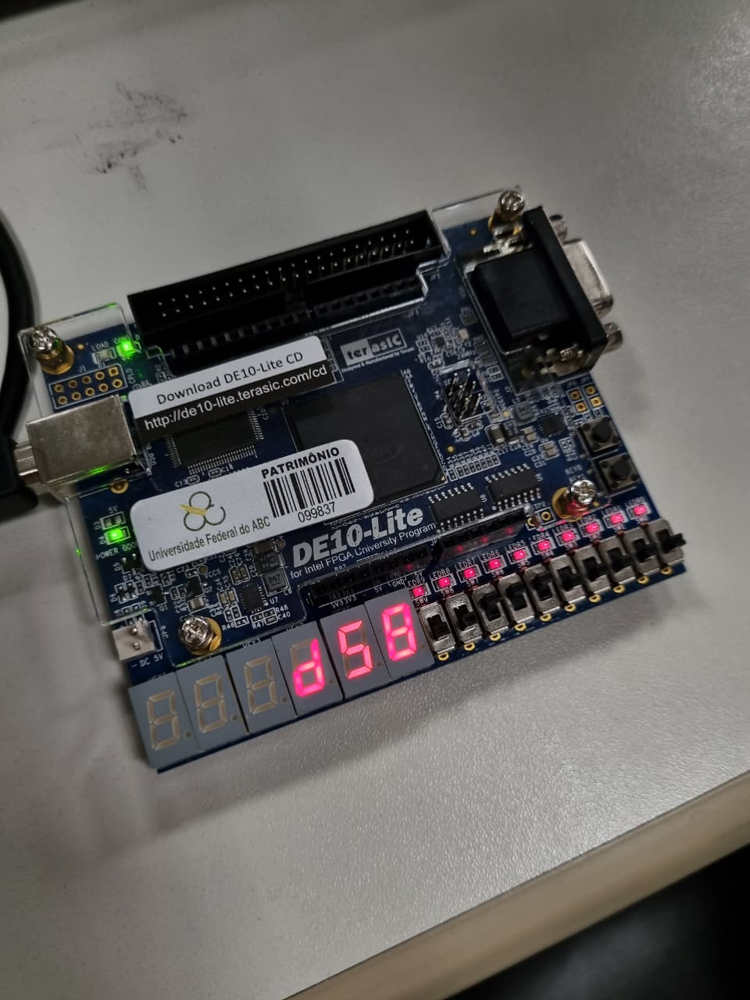

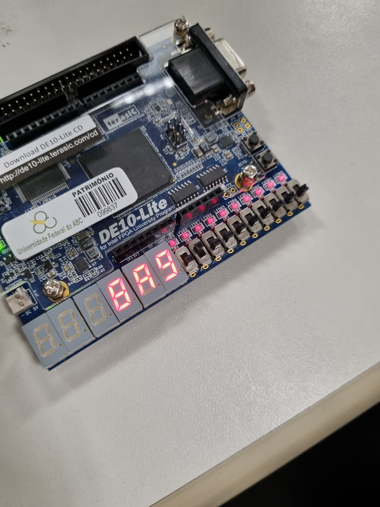

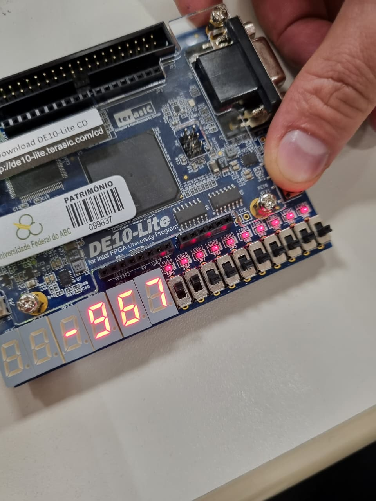

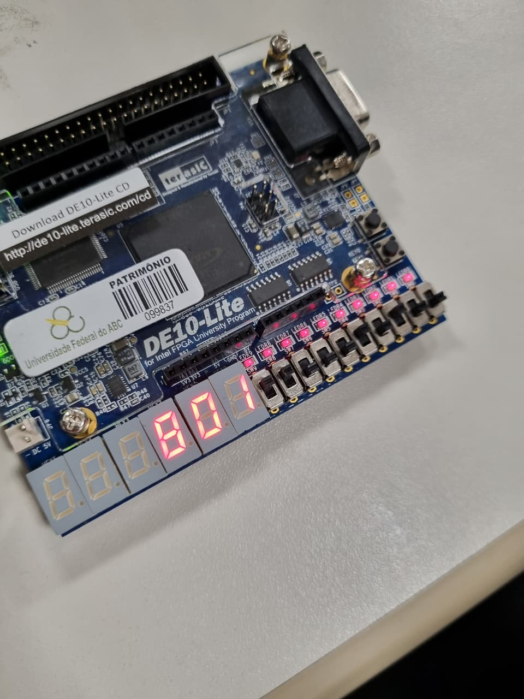

# *Etapa 4 (considerando que a Etapa 4 considera toda a documentação em si)*

## 5. Diário de Bordo de IA 

Utilizamos o ChatGPT, modelo GPT-5.6 Thinking, como ferramenta de apoio na compreensão do algoritmo, na elaboração dos casos de teste e na organização da documentação.

As respostas não foram aplicadas automaticamente. O grupo realizou cálculos manuais, compilou os arquivos com GHDL e conferiu as formas de onda no GTKWave antes de aceitar as sugestões.

**Prompts Utilizados:**

Ambos prompts e respostas relacionados à compreensão do código original e adaptação do display de sete segmento estão registrados na conversa:

- [Análise e comentários do código original](https://chatgpt.com/share/6a71382a-0c7c-83e9-bea5-59d8fd0408ca)

- [Adaptação para a DE10-Lite e display de sete segmentos](https://chatgpt.com/share/6a71382a-0c7c-83e9-bea5-59d8fd0408ca)


**O Erro da IA (Alucinação):**

A IA sugeriu um código bem diferente do proposto na aula de Laboratório 03. Entretanto, como ela não tinha o contexto da aula, isso deveria ser esperado.

**A Correção Humana:**

Como dito na alucinação, o código proposto divergia bastante do visto em aula. Entretanto, para o prompt proposto, os valores eram os desejados (visto que em sala de aula o barramento estava invertido, para fins de aprendizado). Desta forma, os valores propostos em código condiziam com o esperado. Desta forma, utilizamos parte do código proposta pela IA, considerando o esqueleto de código que já possuíamos da aula de laboratório.

## 6. Contribuição dos participantes

As contribuições devem ser confirmadas entre os integrantes antes da entrega, utilizando a taxonomia CRediT.

* **João Paulo Vieira de Carvalho:** Administração do projeto; Software; Análise formal; Metodologia; Validação de dados e experimentos; Visualização; Redação — rascunho original; Redação - revisão e edição.
* **Guilherme Carvalho Torres:** Administração do projeto; Software; Validação de dados e experimentos; Redação — revisão e edição.
* **João Pedro Kayano Leal:** Administração do projeto; Software; Validação de dados e experimentos; Redação — revisão e edição.
