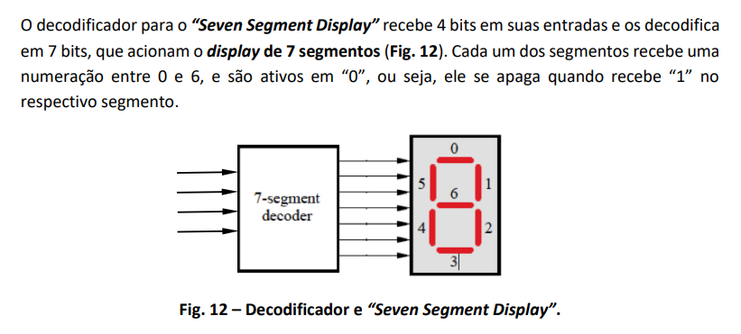

# Passo a passo feito para conclusão da Etapa 02

## Cuidados Iniciais

Da mesma forma que na etapa 01, primeiro é necessário pegar o código do projeto fornecido (desta vez, o Listing 3.20 Floating-point adder testing circuit). Após isso, fazemos a etapa de tratar os apóstrofes substituindo por aspas simples, trocar = > por => e outros (coisa que foi feita de forma similar na etapa 01).

Também precisamos pegar o fp_adder que foi trabalhado na etapa 01. Pegamos então o fp_adder_tratado.vhd e renomeamos tanto o arquivo quanto as partes dentro dele de fp_adder_tratado para fp_adder, já que o novo código que acabamos de trazer faz referências ao fp_adder.

## Etapa de entendimento do código

Para entender melhor, após o código ser tratado (identado e corrigido, conforme explicado acima), pedimos que uma IA gerasse comentários sobre o código, para entendermos melhor sobre o que ele falava. O prompt e resposta da AI pode ser conferidos em: https://chatgpt.com/share/6a6ff2c6-3f08-83e9-8f6c-3e816de31898. Os comentários foram retrabalhados de forma a se adequar mais às necessidades do grupo.

OBS: O arquivo fp_adder_test_original.vhd é o arquivo após ser copiado e limpo, enquanto o arquivo fp_adder_test_comentado.vhd é o que contém comentários de IA, que auxiliam no entendimento do problema e dos próximos passos a serem feitos.

## Explicação passo a passo

Com o código analisado, iniciamos uma nova etapa, de conversão do código inicial (fp_adder_test_original.vhd, em etapa-02/codigo-inicial) para a fpga DE10-Lite. Ela se deu da seguinte forma.

### Análise da entity

Percebemos que, para a FPGA da disciplina, os sinais de clk, an e sseg não eram necessários, visto que o display da DE10-Lite funciona com saídas independentes. Desta forma, eliminamos estas variáveis. Instanciamos os 4 displays para substituir esta parte da lógica e fizemos as alterações correspondentes entre os switches (que são 10 na DE10-Lite) e botões (2).

### Análise dos inputs

Buscamos preservar ao máximo a distribuição utilizada no circuito original. Como a DE10-Lite possui dez switches e dois botões, foi necessário redistribuir os controles que formam os operandos.

O primeiro operando possui sinal e expoente fixos. Apenas dois bits da fração são controlados pelos switches:

sign1 = 0

exp1 = 1000

frac1 = 1 & SW(1) & SW(0) & 10101

O segundo operando é formado da seguinte maneira:

sign2 = SW(9)

exp2 = SW(8 downto 5)

frac2 = 1 & not KEY(1) & not KEY(0) & SW(4 downto 0)

Os botões KEY da placa DE10-Lite são tratados como ativos em nível baixo. Dessa forma, um botão solto produz um bit 0 e um botão pressionado produz um bit 1
após a operação 'not' (sem isso, o botão solto produz 1 e o botão pressionado produz 0).

É importante observar que SW(1) e SW(0) são compartilhados pelos dois operandos: eles alteram dois bits de frac1 e também pertencem aos cinco bits menos significativos de frac2.

### Construção do arquivo para display de 7 segmentos

Neste momento, voltamos o olhar para a construção do vhd que "monta" o display de 7 segmentos. No material das aulas, já havia sido construído um versão do display de sete segmentos (corrigido em aula).

A imagem, retirada do material ministrado em aula, foi utilizada para montarmos o arquivo do display de sete segmentos. Fizemos mudanças para que ele ficasse mais intuitivo visto que, para fins didáticos, o vetor tinha sido declarado em ordem inversa. A construção do código foi auxiliada por IA (Chat GPT modelo GPT-5.6 Thinking), e a conversa pode ser visualizada clicando [aqui](https://chatgpt.com/share/6a71382a-0c7c-83e9-bea5-59d8fd0408ca)

### Adaptação das saídas para os displays da DE10-Lite

No circuito original, os quatro displays compartilhavam o barramento `sseg`. O sinal `an` selecionava qual display estava ativo em cada instante, enquanto o componente `disp_mux` utilizava o clock para alternar rapidamente entre os displays.

Na DE10-Lite, cada display possui sua própria saída, identificada como HEX5, HEX4, HEX3, HEX2, HEX1, HEX0. Destas estamos usando somente HEX3, HEX2, HEX1, HEX0 Dessa forma, não é necessário selecionar e alternar os displays, permitindo a remoção de `clk`, `an`, `sseg` e `disp_mux`.

Para este projeto, os quatro displays utilizados representam as seguintes partes dos operandos:

- HEX0: expoente do resultado;
- HEX1: quatro bits menos significativos da fração;
- HEX2: quatro bits mais significativos da fração;
- HEX3: sinal do resultado.

Os valores de quatro bits apresentados em HEX2, HEX1 e HEX0 passam por instâncias do componente `hex_to_7seg_de10_lite`, que converte cada valor hexadecimal no padrão correspondente dos sete segmentos.

O display HEX3 não precisa de um decodificador hexadecimal, pois ele possui somente dois estados:

- resultado positivo: todos os segmentos apagados;
- resultado negativo: somente o segmento central, numerado como 6, aceso, formando um traço.

Como os displays da DE10-Lite são ativos em nível baixo, o padrão usado para o sinal negativo é `1111110`, enquanto o display apagado utiliza `1111111`.

A organização visual do resultado é:

HEX3 | HEX2 | HEX1 | HEX0

sinal | fração mais significativa | fração menos significativa | expoente